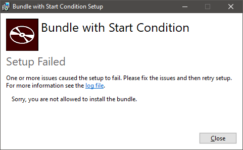

# Bundle with Start Condition

## Description

This pill will demonstrate how to create a starting condition for a bundle. The start condition will prevent the execution of the bundle if the condition is not fulfilled.

It is very similar to the starting condition of an MSI installer. Let's see how it works.

## Implementation

### Step 0: Create two dummy installers

Before starting to create our bundle, let's create two dummy MSI projects that will be, later, included in the bundle:

- `Installer1.msi`
- `Installer2.msi`

Each installer will deploy a single text dummy file.

The focus of the current tutorial is the bundle itself. Therefore, for more details about creating the dummy installers see the [My First Installer](https://github.com/WiX-Toolset-Pills-15mg/My-First-Installer) pill.

**Note**: The two MSI files created by these projects are two normal installers that can also be installed independently.

### Step 1: Create a new bundle project

In the same Visual Studio solution, create a new bundle project:

- Right click on the solution -> Add -> New Project... -> "Bootstrapper Project for WiX v3" -> Next


Include in the installation chain the two installers created earlier:

```csharp
<Chain>
    <MsiPackage SourceFile="$(var.Installer1.TargetDir)$(var.Installer1.TargetName).msi" />
    <MsiPackage SourceFile="$(var.Installer2.TargetDir)$(var.Installer2.TargetName).msi" />
</Chain>
```

The `Chain` is the list of packages managed by the bundle. This is one of the few elements, if not the only one, in WiX Toolset where the order is important. The order in which are places the packages here is the order ion which they are installed. The uninstallation process is uninstalling the packages in the reverse order.

> **Note**: The installers have no properties and no other configuration is needed for them, so for simplicity, we included them directly in the `<Chain>` tag. In a real project it is a good approach to extract each package in a different file and reference them here using the `<PackageGroupRef>` element.

Build to verify that everything is ok.

This is the bundle in which we'll show how a start condition can be implemented.

### Step 2: Add the WiX Bal extension

First, let's reference the `WixBalExtension.dll` file:

- Right click on the bundle project in Solution Explorer -> Add -> Reference... -> Browse -> Select the dll file. It can be found in the WiX Toolset installation directory: `C:\Program Files (x86)\WiX Toolset v3.11\bin\\WixUtilExtension.dll` -> Add -> OK


This library is needed in order to use the `<bal:Condition>` element.

### Step 3: Add bal namespace

The `bal` namespace is also needed to be specified on the `<Wix>` element:

```xml
<Wix
    xmlns="http://schemas.microsoft.com/wix/2006/wi"
    xmlns:bal="http://schemas.microsoft.com/wix/BalExtension">
    
    ...
</Wix>
```

### Step 4: Create the `AllowToInstall` variable

This variable will control if the bundle is allowed to be installed or not.

```xml
<Variable
    Name="AllowToInstall"
    Type="string"
    Value="yes"
    Persisted="no"
    bal:Overridable="yes" />
```

Unlike the properties from an installer, the variables from a bundle, in order to make them public, they are not forced to be full uppercase. Instead, an attribute is used: `bal:Overridable="yes"`. Now, the variable can be provided from command line.

### Step 5: Create the condition

In this example, the condition is based on the `AllowToInstall` variable:

```xml
<bal:Condition Message="Sorry, you are not allowed to install the bundle.">
    <![CDATA[AllowToInstall = "yes"]]>
</bal:Condition>
```

- If the `AllowToInstall` variable has the value `yes`, the condition evaluated to `true` and the installer is continuing its execution.
- If the `AllowToInstall` variable has the value `no` or any other value, the condition evaluated to `false`, the installer is displaying the error message from the `Message` attribute to the user and it will stop its execution.

### Step 6: Run the bundle with failing condition

Run the bundle passing the `AllowToInstall=no` argument.

```
BundleWithStartCondition.exe /l install-not-allowed.log AllowToInstall=no
```

This will prevent the bundle to continue and the error message is displayed in the GUI:



Same error message can be found in the log file:


Please note that the bundle evaluates the specified conditions during the "Detect" phase.

> **Note**: A bundle has three execution phases:
>
> - **Detect** - For each package it contains, verifies in the system if it is installed or not.
> - **Plan** - Displays the GUI and decides what actions to perform for each package (install or uninstall).
> - **Apply** - Does, one by one, each action decided in the Plan phase.

### Step 7: Install the bundle

Run again the bundle, without the `AllowToInstall` argument:

```
BundleWithStartCondition.exe /l install.log
```

It will be successfully installed.

